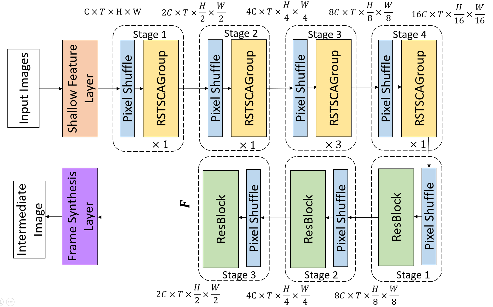
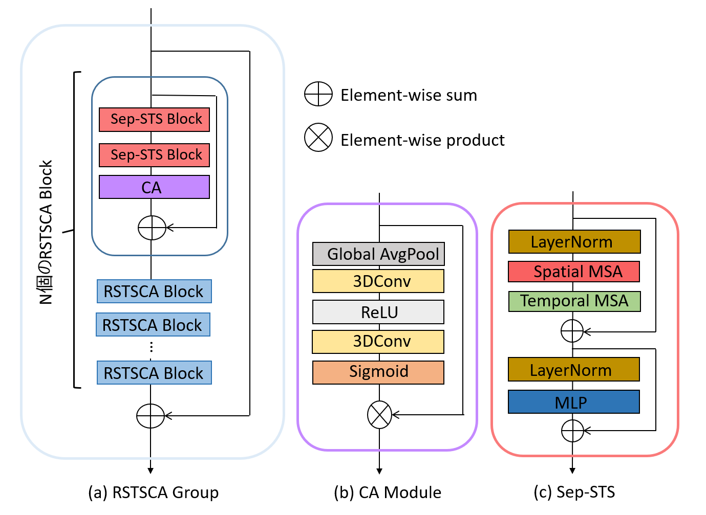
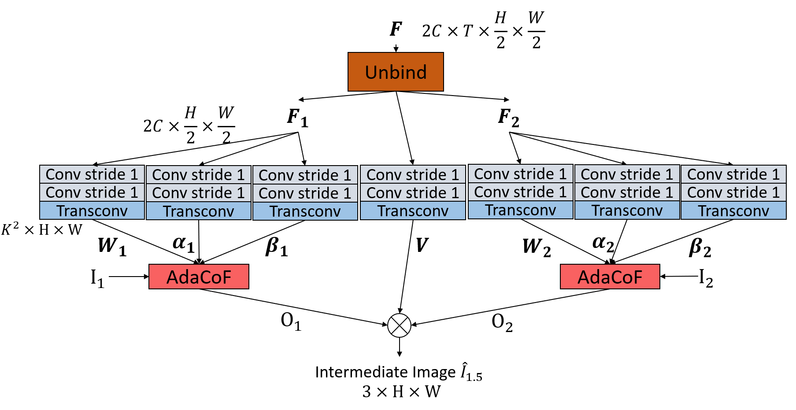

# RSTSCANet_VFI
This is the repo for my research about Video Frame Interpolation.

## Dependencies
Current version is tested on: 
* python == 3.8
* numpy == 1.19.5
* [pytorch](https://pytorch.org/) == 1.10.1, torchvision == 0.11.2, cuda == 11.3
* cupy == 10.6.0
* tensorboard == 2.11.0
* einops == 0.4.1

## Train
* I use [Vimeo90K Triplet dataset](http://toflow.csail.mit.edu/) for training + testing
* Then train RSTSCANet as below:
```
python main.py --datasetName Vimeo_90K --datasetPath <dataset_path> --batch_size <batch_size>
```

## Test
After training, you can evaluate the model with following command:
```
python test.py --checkpoint_dir <checkpoint_directory> --datasetName <Vimeo90K or UCF101> --datasetPath <dataset_path> 
```

* For UCF101 test dataset, you can download from [here](https://drive.google.com/file/d/0B7EVK8r0v71pdHBNdXB6TE1wSTQ/view?resourcekey=0-r6ihCy20h3kbgZ3ZdimPiA)
* Download pretrained model from [here](https://www.dropbox.com/scl/fo/ayey1dcz9f9bit78rbmy4/h?dl=0&rlkey=4d2x7prwi3izhuzlph6sa1jdj)


## Model
This is the model that I created.







# Acknowledgement
Many parts of my code is adapted from*
* [CAIN](https://github.com/myungsub/CAIN)
* [VFIT](https://github.com/zhshi0816/Video-Frame-Interpolation-Transformer)

I am very thankful for the authors for sharing codes for their great works.
